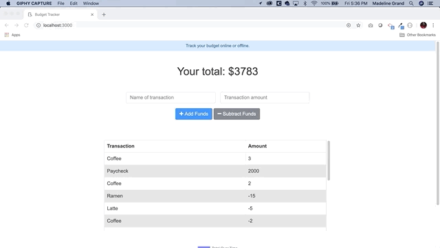

# Budget Tracker

The Budget Tracker is a Progressive Web App (PWA) that that allows you to add expenses and deposits to your budget with or without a connection. When entering transactions offline, you can populate the total when brought back online.


## Screenshot of Application



## Live Link
- Launch the application [here](---)

## Instructions for local install

Initialize with required npm packages using this command:

```sh
npm install
npm start
```

## Technologies Used
- HTML5
- CSS3
- JavaScript
- Express
- Node.js
- MongoDB
- Mongoose

## Features
- Offline Functionality:
    - Enter deposits offline
    - Enter expenses offline
- When brought back online:
    - Offline entries should be added to tracker.

## Business Context
Giving users a fast and easy way to track their money is important, but allowing them to access that information anytime is even more important. Having offline functionality is paramount to our applications success.

## User Story
- AS AN avid traveller
- I WANT to be able to track my withdrawals and deposits with or without a data/internet connection
- SO THAT my account balance is accurate when I am traveling

## Acceptance Criteria
- GIVEN a user is on Budget App without an internet connection
- WHEN the user inputs a withdrawal or deposit
- THEN that will be shown on the page, and added to their transaction history when their connection is back online.

- - -
© 2020 [Madeline Jimenez](https://github.com/mijimenez)